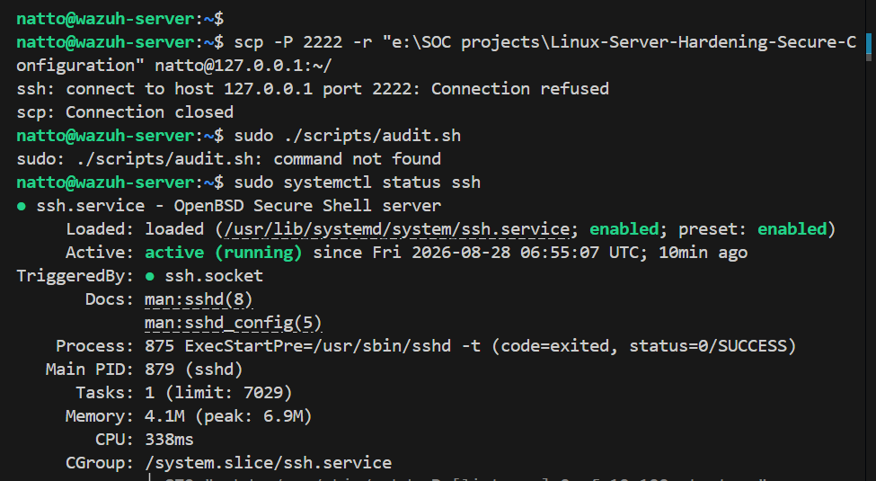
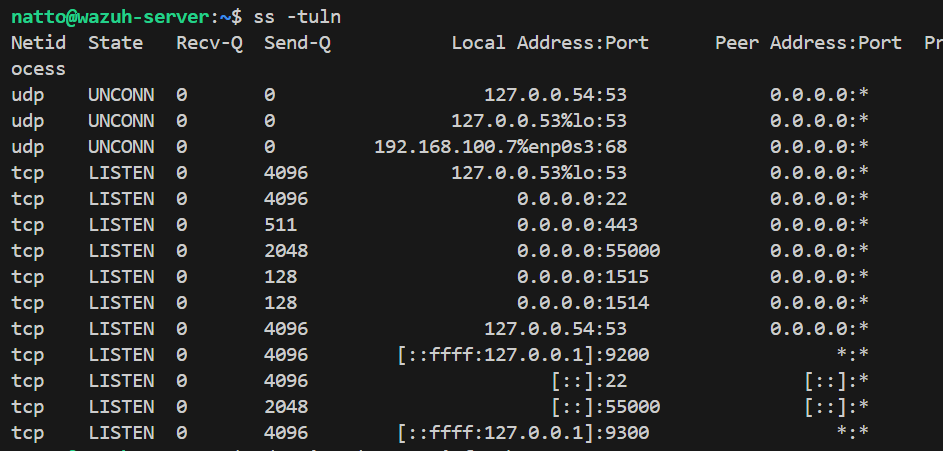
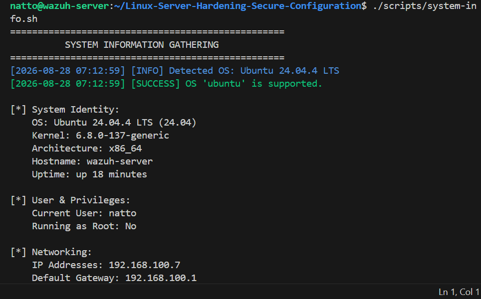
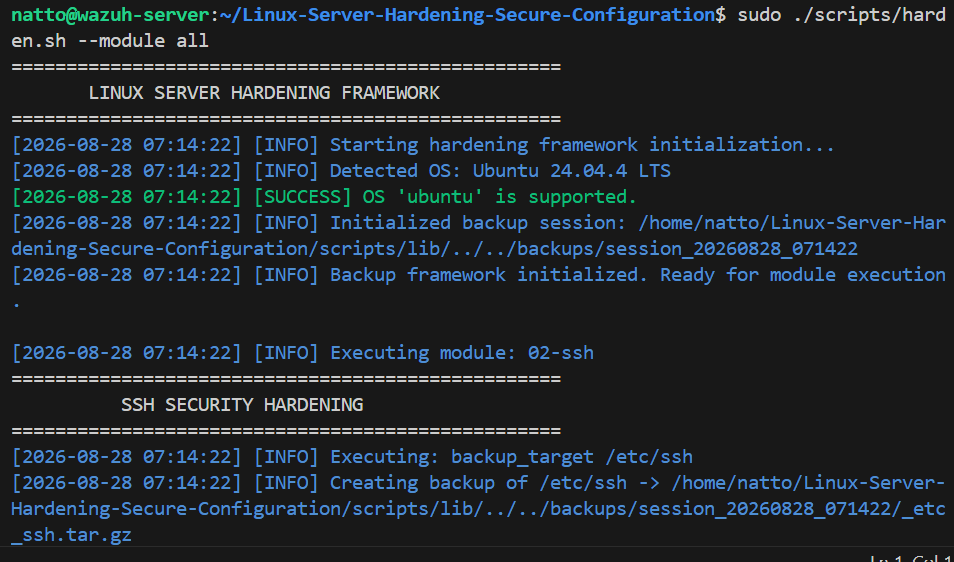
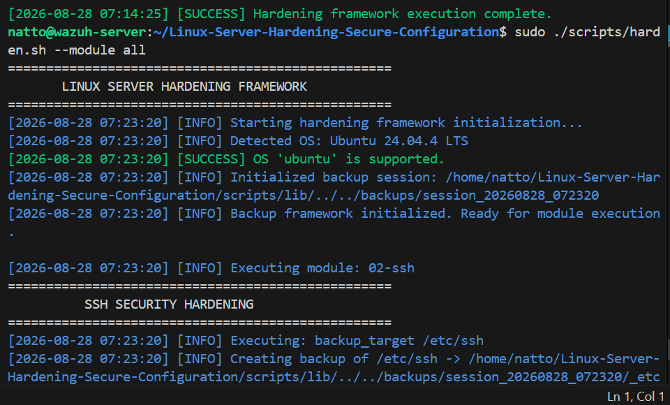
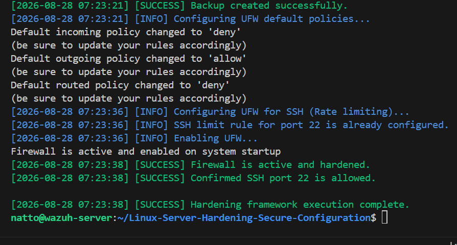
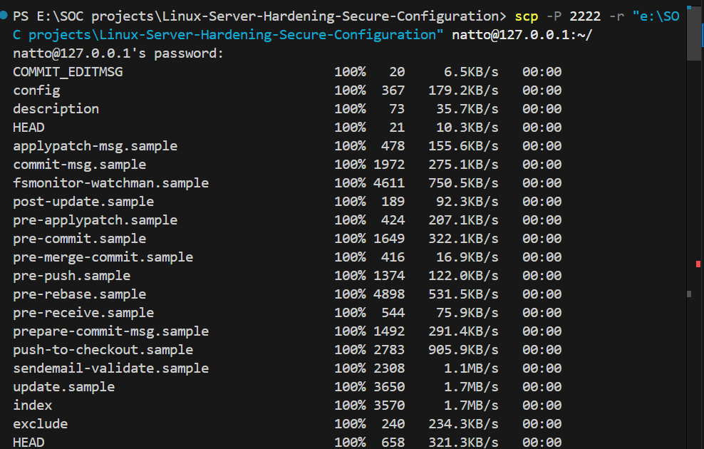
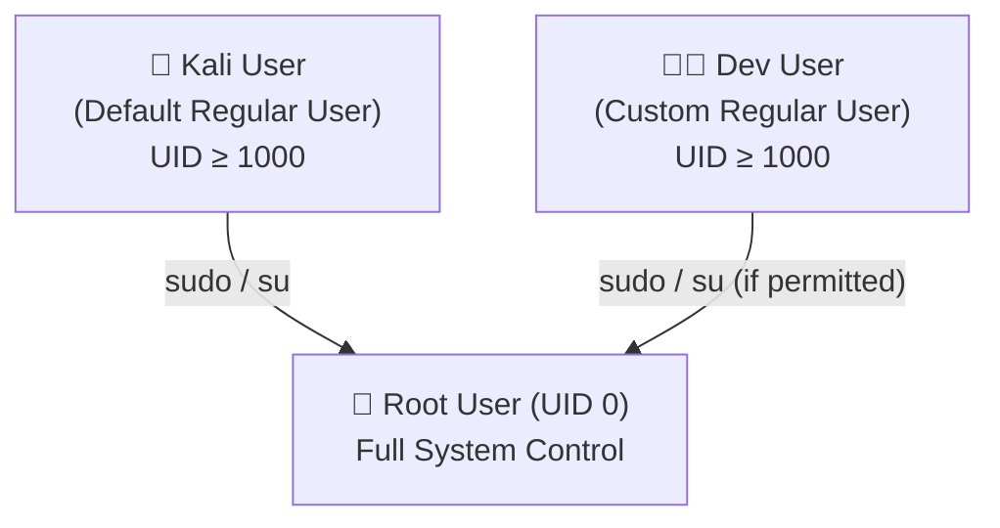

<p align="center">
  
</p>

<h1 align="center">🔐 Linux Server Hardening & Secure Configuration</h1>

<p align="center">
  <b>System Security • SSH Hardening • Firewall Enforcement • Least Privilege • Security Auditing</b>
</p>

<p align="center">
  
  
  
  
</p>

---


> [!CAUTION]
> **DEVELOPMENT STATUS**: This project has completed **Phase 4** of its transformation into an automated framework!
> All modules (SSH, Firewall, Sysctl, Fail2Ban, Auditd, and Lynis) are active, tested, and ready for production use.

## 📌 Project Purpose

The **Linux Server Security Hardening & Continuous Security Audit Framework** is designed to provide an automated, idempotent, and safe method for securing Linux servers. It enforces industry standards (like CIS Benchmarks) while prioritizing administrator safety through automated backups, dry-run modes, and strict system validations.

## 🎯 Current Capabilities (Phase 4 Final)
- **Automated Security Scoring**: Runs Lynis automatically to generate a Hardening Index score and saves comprehensive audit reports.
- **Advanced Security**: Sysctl network hardening, Fail2Ban dynamic bans, and Auditd kernel-level monitoring.
- **SSH Hardening**: Idempotently enforces key-based auth, disables root login, and validates configurations using `sshd -t` before restarting.
- **Firewall Hardening**: Configures UFW with default deny policies while dynamically detecting and rate-limiting the active SSH port to prevent lockouts.
- **System Detection**: Safely detects OS, version, kernel, and network stats.
- **Root & OS Validation**: Strictly ensures the script is run securely on supported OSs (Ubuntu, Debian, Kali).
- **Atomic Backups**: Infrastructure creates timestamped backups of configuration files before any modifications.
- **Dry-Run Mode**: Simulates actions without altering the system.
- **Read-Only Auditing**: Gathers system baselines and security statuses without making changes.

## 🏗 Architecture
- `scripts/harden.sh` - Main framework orchestration.
- `scripts/lib/` - Reusable functions (logging, validation, backups).
- `scripts/audit.sh` - Generates security baselines.
- `docs/` - Detailed documentation (Architecture, Installation, Usage, etc.).

## 🚀 Installation & Usage

### 1. Clone & Prepare
```bash
git clone https://github.com/NATTOMR/Linux-Server-Hardening-Secure-Configuration.git
cd Linux-Server-Hardening-Secure-Configuration
chmod +x scripts/*.sh scripts/lib/*.sh
```

### 2. Check System Info
```bash
./scripts/system-info.sh
```

### 3. Run Dry-Run (Simulation)
```bash
sudo ./scripts/harden.sh --dry-run
```

### 4. Create Security Baseline
```bash
sudo ./scripts/audit.sh
```

## 🧪 Testing Environment
Testing is currently conducted on isolated **Ubuntu Server** and **Kali Linux** virtual machines. The scripts use `set -Eeuo pipefail` to ensure robust error handling.

## 🗺 Roadmap
- **Phase 1 (Complete):** Core Automation & Safety Foundation.
- **Phase 2 (Complete):** Modular Hardening Implementation (SSH, UFW).
- **Phase 3 (Complete):** Advanced Security (Sysctl, Fail2Ban, Auditd).
- **Phase 4 (Complete):** Automated Security Scoring & Reporting.

---

## 🔍 Legacy Manual Implementation Reference (Pre-Automation)

---
## What Is Server Hardening?
Server hardening means protecting your Linux server by reducing its vulnerability surface. It’s like locking every door and window of your house before you go on vacation. You remove unnecessary services, close open ports, and implement security best practices to ensure your server stays safe from intruders.

## Why It Matters?
Even though Linux is considered more secure than many other operating systems, it’s not immune to attacks. Poor configurations, outdated software, or weak passwords can make your server an easy target.

## 📸 Execution Demonstration

The following screenshots demonstrate the framework successfully analyzing, backing up, and hardening the server across all 4 phases:









## Disclaimer
This script is provided for educational and administrative purposes. Ensure you have tested this in a staging environment prior to running on production systems. The developers are not responsible for accidental system lockouts.

## License
MIT License

## 1️⃣ Review Default System Settings
Understand the system before making changes.

``bash
### Check OS version
` lsb_release -a` <br>

#### Result:

- OS: Kali GNU/Linux Rolling

- Release: 2025.4

- Codename: kali-rolling

- Purpose:
    Verifying the OS version helps ensure proper patch management and vulnerability assessment. This establishes a secure baseline before applying hardening configurations.

### List users
`cut -d: -f1 /etc/passwd`<br>


#### Result:

- Only system accounts and default service accounts were present.

- No unnecessary or suspicious user accounts detected.

- Purpose:
   Reviewing user accounts ensures the system follows the principle of least privilege and reduces the risk of unauthorized access.

### List running services
`systemctl list-units --type=service`<br>


#### Result:

- Only system accounts and default service accounts were present.

- No unnecessary or suspicious user accounts detected.

- Purpose:
Reviewing user accounts ensures the system follows the principle of least privilege and reduces the risk of unauthorized access.

### Check open ports
`ss -tuln`<br>


#### Result:

- Only port 22 (SSH) was open.

- No additional exposed services.

- Purpose:
Limiting open ports significantly reduces network attack vectors and prevents unauthorized remote access.


## 2️⃣ User Account Hardening

- Remove unused users and restrict privileges.

### Delete unused user
`sudo userdel -r username`

### View sudo users
`getent group sudo` <br>

- Result:

    - Only authorized users were members of the sudo group.

- Purpose:

  - Ensures limited administrative access

  - Enforces the Principle of Least Privilege

  - Reduces risk of privilege escalation
    
### Edit sudo access:

`sudo visudo`


  - ✔ Apply least privilege
  - ✔ Avoid using root for daily tasks

## 3️⃣ Secure SSH Configuration <br>

### 👥 User Privilege Hierarchy (Mermaid Diagram)




## 👥 User Roles Summary

| Feature | Root User | Kali User | Dev User |
|----------|------------|------------|------------|
| UID | 0 | ≥1000 | ≥1000 |
| Purpose | Full system administration | Default daily user | Custom regular user |
| System Control | Full access | Limited | Limited |
| Can Use sudo | Not required | Yes | Only if granted |
| Modify System Files | Yes | With sudo | With sudo (if allowed) |
| Safe for Daily Use | No | Yes | Yes |
| Risk if Compromised | Critical | Medium | Medium |

    ```

- Disable root login and enforce key-based authentication.

`sudo nano /etc/ssh/sshd_config`


## Update the following:

```
PermitRootLogin no
PasswordAuthentication no
PubkeyAuthentication yes
```


### Restart SSH:

`sudo systemctl restart ssh`


### 4️⃣ Update System & Enable Automatic Security Updates
```
sudo apt update && sudo apt upgrade -y
sudo apt install unattended-upgrades -y
sudo dpkg-reconfigure unattended-upgrades
```
- ✔ Keeps system patched
- ✔ Reduces known vulnerabilities

### 5️⃣ Configure Firewall (UFW)
    sudo ufw default deny incoming
    sudo ufw default allow outgoing
    sudo ufw allow ssh
    sudo ufw enable
    sudo ufw status verbose
    
<br>

- Firewall is enabled

- Logging is active (medium level)

- Rules are enforced at boot
  
- Result: Only essential network traffic is allowed.

### 6️⃣ Disable Unnecessary Services
    systemctl list-unit-files --type=service <br>


### Disable unused services:

    sudo systemctl disable servicename
    sudo systemctl stop servicename
    <br>


- ✔ Reduces attack surface
- ✔ Improves system performance

### 7️⃣ Secure File Permissions

Protect sensitive system files.

### Secure shadow file
    sudo chmod 640 /etc/shadow

### Secure SSH directory
    chmod 700 ~/.ssh
    chmod 600 ~/.ssh/authorized_keys


Goal: Prevent unauthorized file access.

### 8️⃣ Log Monitoring & Auditing
- View authentication logs
  `sudo cat /var/log/auth.log`

### Check system logs
`sudo journalctl -xe`


### (Optional) Install auditing tools:

    sudo apt install auditd -y


- ✔ Detect suspicious activity
- ✔ Improve incident response

### 9️⃣ Security Auditing with Lynis
    sudo apt install lynis -y
    sudo lynis audit system


### Install missing security packages:

`sudo apt install fail2ban apt-listbugs apt-listchanges needrestart`


#### Consider:

- Enable intrusion detection

- Enable bootloader password

- Install malware scanning tools

- Reduce unnecessary running services

- Customize /etc/lynis/default.prf


### Results:

 - Hardening Index: 64/100

 - 273 tests performed

 - Firewall detected

 - Intrusion detection installed

  - Malware scanner installed
## ✅ Linux Hardening Checklist

    Removed unused users

    Restricted sudo access

    Disabled root SSH login

    Enabled SSH key authentication

    Firewall configured (UFW)

    Disabled unused services

    Secured sensitive file permissions

    Enabled automatic updates

    Reviewed system logs

    Performed security audit

## 📄 Security Configuration Summary

    SSH hardened with key-based authentication

    Firewall restricts inbound connections

    System is auto-patched for vulnerabilities

    Least privilege enforced

    Logs monitored for anomalies

    Auditing validates security posture

## 📚 References

The following industry-recognized resources were used as guidance for implementing Linux server hardening best practices:

1. CIS Benchmarks – Linux Security Standards <br>
https://www.cisecurity.org/cis-benchmarks

2. Ubuntu Security Documentation <br>
https://ubuntu.com/security

3. OpenSSH Official Documentation <br>
https://man.openbsd.org/sshd_config

4. Lynis Security Auditing Tool <br>
https://cisofy.com/lynis/

5. NIST Cybersecurity Framework (CSF) <br>
https://www.nist.gov/cyberframework


## 👨‍💻 Author

NATTO MUNI CHAKMA <br>
Cybersecurity Enthusiast | Linux Security | SOC Analyst & Blue team learner
